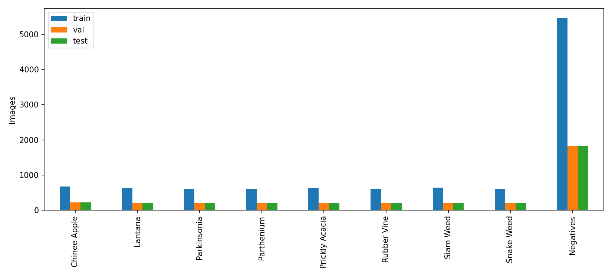
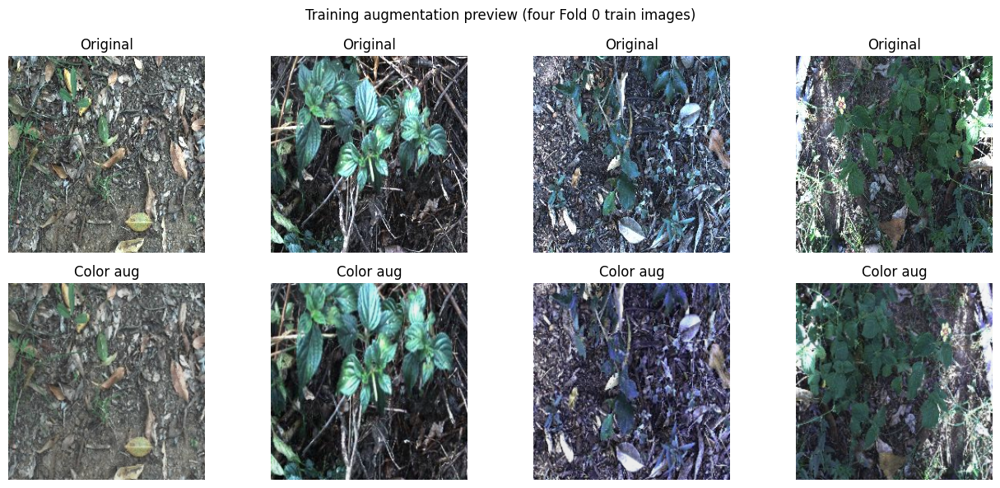
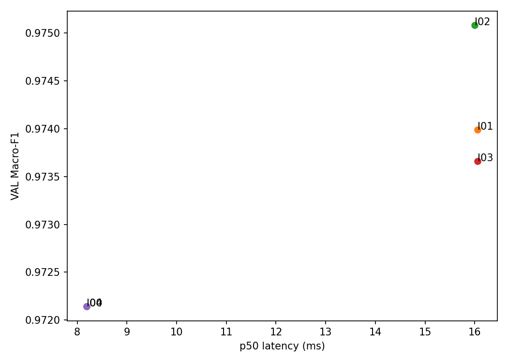
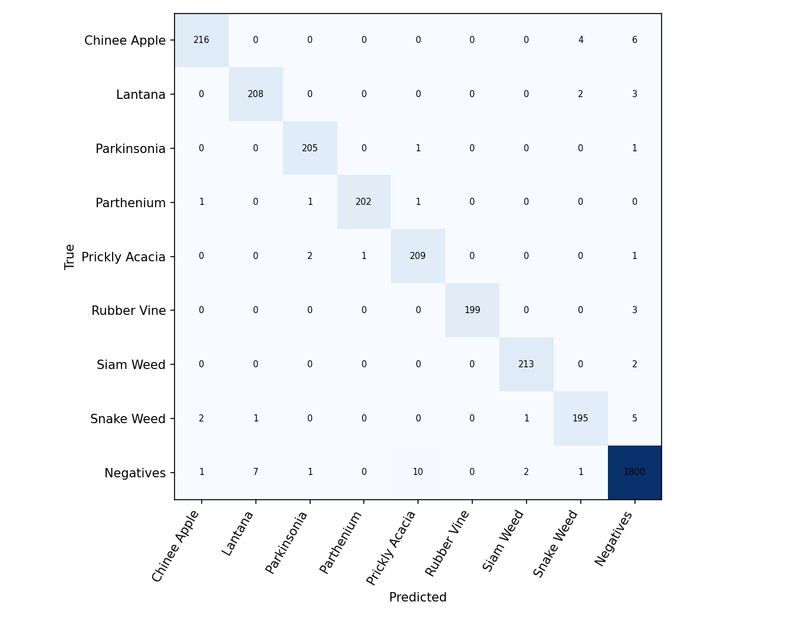
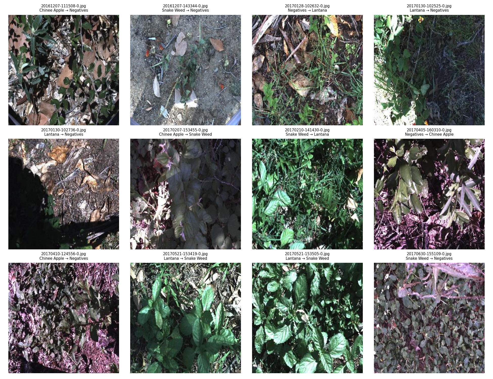

# DeepWeeds — Track 4 Day 2
Vu Gia Khai — MSSV 2A202602786

## 1. Tóm tắt
So sánh 5 backbone, các công thức huấn luyện trên VAL và 4 phương pháp suy luận.
F01 dùng convnext_tiny, công thức T07, suy luận I04 (temperature scaling; T khớp riêng trên VAL từng seed). T00 dùng I00.
TEST Macro-F1 trung bình 0.975785; baseline 0.827366; Δ=0.148419.
Mức tăng vượt std lớn hơn của hai nhóm seed. Các con số được tính từ CSV dự đoán thật; xem bảng Final để có mean ± std đầy đủ.

## 2. Dữ liệu và thiết lập
DeepWeeds 17.509 ảnh, 9 lớp, official fold 0, seeds 0/1/2 cho chung kết và baseline.
Không dùng TEST để chọn backbone, recipe hoặc inference. Chỉ VAL dùng để lựa chọn.
GPU: Tesla T4. Python 3.13.13, PyTorch 2.12.0+cu132, timm 1.0.30.
Các phiên bản đầy đủ và hyperparameters được lưu trong requirements-lock.txt và logs/.


Các kiểm tra loss ban đầu và overfit một batch được lưu ở `evaluation/sanity_checks.json`.

## 3. So sánh backbone
| exp_id | backbone | tag | params_m | gmacs | img_size | epochs | seed | val_macro_f1 | val_top1 | train_time_min | latency_p50_ms | note | train_time_per_epoch_min |
| --- | --- | --- | --- | --- | --- | --- | --- | --- | --- | --- | --- | --- | --- |
| B01 | resnet34 | timm/default | 21.29 | 3.66 | 224 | 12 | 0 | 0.8217 | 0.8669 | 6.48 | 5.4 | Công thức nền T00 | 0.54 |
| B02 | convnext_tiny | timm/default | 27.83 | 0.32 | 224 | 12 | 0 | 0.9624 | 0.9709 | 11.57 | 8.25 | Công thức nền T00 | 0.9641666666666667 |
| B03 | deit_small_patch16_224 | timm/default | 21.67 | 0.08 | 224 | 12 | 0 | 0.9551 | 0.9672 | 7.55 | 6.28 | Công thức nền T00 | 0.6291666666666667 |
| B04 | mobilenetv3_large_100 | timm/default | 4.21 | 0.22 | 224 | 12 | 0 | 0.8449 | 0.8852 | 5.91 | 8.54 | Công thức nền T00 | 0.4925 |
| B05 | resnext50_32x4d | timm/default | 23.0 | 4.23 | 224 | 12 | 0 | 0.8606 | 0.8929 | 12.0 | 7.34 | Công thức nền T00 | 1.0 |
Chọn backbone có VAL Macro-F1 cao nhất theo số đo trên cùng split, seed, epochs và công thức nền.
GMAC từ bộ đếm hooks là ước lượng, đặc biệt có thể thiếu chi phí attention của transformer.

## 4. Công thức huấn luyện
| exp_id | backbone | axis | diff_vs_t00 | seed | val_macro_f1 | val_top1 | delta_vs_t00 | rare_class_f1 | note |
| --- | --- | --- | --- | --- | --- | --- | --- | --- | --- |
| T01 | convnext_tiny | Augmentation | ColorJitter | 0 | 0.9538 | 0.9623 | -0.0086 | - | Epoch tốt nhất: 11 |
| T02 | convnext_tiny | Augmentation | CutMix (alpha=1.0) | 0 | 0.9716 | 0.9774 | 0.0092 | - | Epoch tốt nhất: 12 |
| T03 | convnext_tiny | Hàm Loss | Label Smoothing (eps=0.1) | 0 | 0.9625 | 0.9703 | 0.0001 | - | Epoch tốt nhất: 9 |
| T04 | convnext_tiny | Hàm Loss | Focal Loss (gamma=2.0) | 0 | 0.9587 | 0.968 | -0.0037 | - | Epoch tốt nhất: 12 |
| T08 | convnext_tiny | Khởi tạo | From scratch | 0 | 0.3839 | 0.5801 | -0.5785 | - | Epoch tốt nhất: 11 |
| T05 | convnext_tiny | Khởi tạo | Frozen Backbone | 0 | 0.8607 | 0.8863 | -0.1017 | - | Epoch tốt nhất: 8 |
| T06 | convnext_tiny | Chính quy | EMA Decay 0.999 | 0 | 0.9638 | 0.9723 | 0.0014 | - | Epoch tốt nhất: 10 |
| T07 | convnext_tiny | Kết hợp | CutMix + Label Smoothing + EMA | 0 | 0.9721 | 0.978 | 0.0097 | - | Epoch tốt nhất: 12 |
Thay đổi đơn yếu tố tốt nhất trong các dòng đã chạy: T02, Δ VAL=0.009200.
Các ablation chỉ có một seed nên chưa chứng minh độ ổn định; dòng kết hợp không dùng để quy công cho một yếu tố riêng lẻ.

## 5. Suy luận và hiệu chuẩn
| exp_id | method | model_ckpt | k_views | val_macro_f1 | val_top1 | val_ece | latency_p50_ms | latency_p95_ms | latency_p99_ms | throughput_img_s | relative_cost | gpu | dtype | batch |
| --- | --- | --- | --- | --- | --- | --- | --- | --- | --- | --- | --- | --- | --- | --- |
| I00 | 1-view 224 | runs/T07/seed0/best_model.pth | 1 | 0.972141 | 0.978006 | 0.08801 | 8.190552 | 9.110131 | 10.244967 | 122.091886 | 1.0 | Tesla T4 | amp | 1 |
| I01 | TTA horizontal: probability average | runs/T07/seed0/best_model.pth | 2 | 0.973986 | 0.97972 | 0.090309 | 16.056312 | 16.776587 | 17.942457 | 62.280803 | 1.960345 | Tesla T4 | amp | 1 |
| I02 | TTA vertical: probability average | runs/T07/seed0/best_model.pth | 2 | 0.975082 | 0.980577 | 0.090934 | 15.999543 | 22.295212 | 24.996076 | 62.501785 | 1.953414 | Tesla T4 | amp | 1 |
| I03 | TTA horizontal: logit average | runs/T07/seed0/best_model.pth | 2 | 0.97366 | 0.979434 | 0.089764 | 16.056312 | 16.776587 | 17.942457 | 62.280803 | 1.960345 | Tesla T4 | amp | 1 |
| I04 | Temperature scaling T=0.6240 | runs/T07/seed0/best_model.pth | 1 | 0.972141 | 0.978006 | 0.004916 | 8.190552 | 9.110131 | 10.244967 | 122.091886 | 1.0 | Tesla T4 | amp | 1 |

Chung kết dùng I04: nhiệt độ được khớp riêng trên VAL cho từng seed rồi áp dụng vào xác suất TEST đã lưu,
không chạy thêm forward và không dùng nhãn TEST để chọn T. predictions/*_uncal_test.csv giữ xác suất gốc để đối chiếu ECE.
ECE TEST trung bình trước/sau temperature scaling lần lượt là 0.088848 / 0.007407; đối chiếu tự chấm ở evaluation/grade_I.json.
Các phương pháp nhiều view phù hợp hơn khi không bị giới hạn thời gian.

## 6. Chung kết, baseline và phân tích lỗi
| exp_id | seed | inference | val_macro_f1 | test_macro_f1 | test_top1 | test_ece |
| --- | --- | --- | --- | --- | --- | --- |
| F01 | 0 | I04: temperature scaling fitted on VAL | 0.9721407761570736 | 0.9785465474126437 | 0.9828913601368692 | 0.004153797825848585 |
| F01 | 1 | I04: temperature scaling fitted on VAL | 0.9742220552518975 | 0.972876650372206 | 0.9783290561733675 | 0.008923677594715252 |
| F01 | 2 | I04: temperature scaling fitted on VAL | 0.9730926018669105 | 0.9759319578210081 | 0.9800399201596807 | 0.009143894369179997 |
| T00 | 0 | I00: single view | 0.8216604706907553 | 0.8395774274998453 | 0.8773880809808954 | 0.014627205047048725 |
| T00 | 1 | I00: single view | 0.8195158778293504 | 0.8285824922700075 | 0.8696891930424865 | 0.020973399406900507 |
| T00 | 2 | I00: single view | 0.8142590199162754 | 0.8139382006878387 | 0.8594240091246079 | 0.01825861408896498 |
| F01_mean_std | 0,1,2 | I04 (F01) / I00 (T00) | nan | 0.975785 ± 0.002838 | 0.980420 ± 0.002305 | 0.007407 ± 0.002820 |
| T00_mean_std | 0,1,2 | I04 (F01) / I00 (T00) | nan | 0.827366 ± 0.012863 | 0.868834 ± 0.009013 | 0.017953 ± 0.003184 |


Cặp nhầm có hướng nhiều nhất ở seed 0: Negatives → Prickly Acacia (10 ảnh).
Chinee Apple → Snake Weed: 4; chiều ngược lại: 2.
Các ảnh trên là ví dụ theo thứ tự CSV, không phải mẫu đại diện ngẫu nhiên. Hình dạng lá, nền thực vật và ánh sáng
là các giả thuyết về nguyên nhân nhầm lẫn, chưa có kiểm chứng nhân quả. F1 từng lớp và baseline nằm trong sheet PerClass.

## 7. Kết luận và khuyến nghị
Δ TEST F01 so với T00 là 0.148419; std lớn hơn giữa hai nhóm là 0.012863. Mức tăng vượt std lớn hơn của hai nhóm seed.
Không thể tách hoàn toàn đóng góp backbone và recipe từ phép so sánh TEST; đối chiếu các ablation VAL riêng ở trên.
I00 p95=9.11 ms chỉ đo model forward trên GPU được ghi, chưa gồm tải ảnh và tiền xử lý.
Với ngân sách robot 30–100 ms/khung, cần benchmark toàn pipeline trên phần cứng triển khai trước khi kết luận đạt yêu cầu.

## 8. Hạn chế
Một fold; ablation một seed; chung kết ba seed; chia ngẫu nhiên có thể lạc quan so với chia theo địa điểm.
Không suy rộng sang miền, mùa hoặc thiết bị khác. Chưa thực hiện thử nghiệm triển khai hoặc kiểm định thống kê chính thức.
Số epoch 12 là giới hạn ngân sách; chỉ sử dụng một GPU của phiên T4 x2.
Đọc lại nhận xét về ảnh lỗi và đường cong trước khi đánh dấu PR sẵn sàng nộp.

## 9. Phụ lục cấu hình chung kết
```json
{
  "fold": 0,
  "drop_rate": 0.0,
  "img_size": 224,
  "aug": "basic",
  "sampler": null,
  "mix": "cutmix",
  "mix_alpha": 1.0,
  "loss": "ls",
  "label_smoothing": 0.1,
  "focal_gamma": 2.0,
  "class_weight_beta": null,
  "epochs": 12,
  "batch_size": 32,
  "lr_backbone": 0.0001,
  "lr_head": 0.001,
  "weight_decay": 0.05,
  "warmup_epochs": 1.0,
  "ema_decay": 0.999,
  "amp": true,
  "num_workers": 2,
  "images_dir": "data/images",
  "labels_dir": "data/labels",
  "out_dir": "runs",
  "pred_dir": "predictions",
  "curves_dir": "curves",
  "save_test_predictions": true,
  "exp_id": "F01",
  "seed": 0,
  "backbone": "convnext_tiny",
  "init": "finetune"
}
```
Các config/history của từng exp_id nằm trong logs/. Notebook và cách chạy nằm trong README.md.
Dataset: https://zenodo.org/records/7939060 ; không commit dataset hoặc checkpoint.
